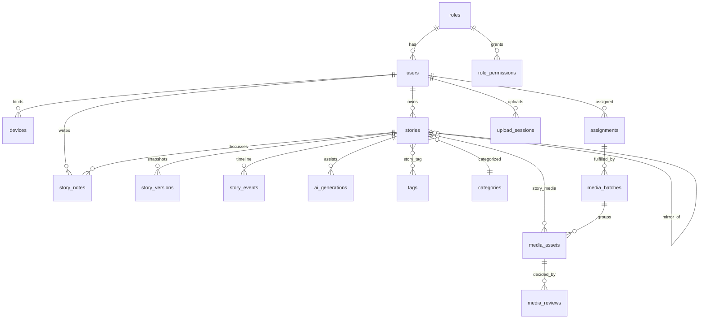
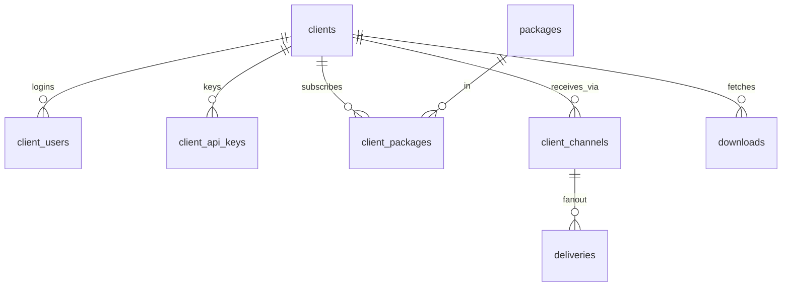

# UNB v1 — Database Design (PostgreSQL 16, Laravel)

**Scope:** complete v1 schema design for the Laravel modular monolith (NFR §16).
**Not in this file:** migration code — a coding agent generates migrations from §10
of this doc. No UI assumptions change; this schema backs the prototype in this folder.
**Inputs:** `v1-non-functional-requirements.md` (esp. §1 search, §2 read/write, §4
archival, §7 async jobs, §8 audit, §11 time), and the UI contracts in `README.md`.

---

## 1. Conventions & global decisions

1. **Primary keys:** `id` bigint identity (Postgres `GENERATED ALWAYS AS IDENTITY`).
   Anything exposed in URLs, API payloads, downloads or webhooks also gets a
   `public_id` ULID (unique index) — never leak sequential ids to clients (NFR §15 `Ids`).
2. **Time:** every timestamp is `timestamptz`, default `now()`, set server-side —
   device/field-app clocks are untrusted (NFR §11). No `timestamp without tz`, ever.
   Business-local concepts ("today's stories") are computed app-side in Asia/Dhaka.
3. **Enums:** `varchar` + `CHECK` constraint, not native PG enums — adding a value
   later is a data-only change, no type-altering migration pain. Laravel enums cast
   to string on the models.
4. **JSONB where the shape genuinely varies:** AI suggestion packs, derivative
   manifests, EXIF, channel configs, entitlement filters, audit diffs. Everything
   queried relationally stays relational. GIN indexes only on JSONB we filter by.
5. **Search is not in the database.** Meilisearch owns all user-facing search
   (NFR §1). The DB keeps an `index_outbox` (transactional outbox pattern) — every
   content write commits + outbox row in the same transaction; a worker syncs
   Meilisearch. No dual-write drift. (`pg_trgm` indexes may be added later as an
   emergency fallback — deliberately skipped in v1.)
6. **Soft deletes** (`deleted_at`) only on `users`, `stories`, `media_assets`,
   `clients`. Log/ledger tables are hard-delete-by-retention-job only.
7. **Immutability:** `story_notes`, `audit_logs`, `story_events`, `deliveries`,
   `downloads` are append-only. Enforce at DB level: the app role gets no
   `UPDATE`/`DELETE` grants on them (chain-of-custody, NFR §8).
8. **Optimistic locking:** `stories.version bigint` incremented on every save;
   `locked_by`/`locked_at` soft edit-lock shown in UI ("Maria is editing now").
   Stale save → 409 + merge prompt (NFR §8). Handover force-releases the lock.
9. **Idempotency:** every async-side table that workers write to carries a unique
   `idempotency_key` (deliveries) or natural unique key — retries must be safe
   (NFR §6 at-least-once fan-out).
10. **Multi-language:** `language` column ('en'|'bn') + `mirror_of_id` self-FK pairing
    a Bangla story with its English mirror (per README: Bangla desk mirrors English
    desk). Not row-per-translation — the desks are separate products.
11. **Naming:** Laravel defaults — snake_case plural tables, `model_id` FKs,
    alphabetical pivot tables. Constraints/indexes get explicit names only where
    Laravel's default is ambiguous (partitions, partial indexes).

---

## 2. Domain A — identity, staff, access

### `roles`
| column | type | notes |
|---|---|---|
| id | identity PK | |
| name | varchar(80) unique | 'Admin', 'Editor', 'Uploader-English'… (seed from roles.html) |
| type | varchar(16) | CHECK in ('system','custom','client') |
| description | text null | |
| is_locked | bool default false | system roles can't be deleted/edited (prototype rule) |
| timestamps | | |

### `role_permissions`
| column | type | notes |
|---|---|---|
| id | identity PK | |
| role_id | FK roles → cascade | |
| module | varchar(40) | 'stories','stories_bn','media','clients','packages','distribution','settings','ai'… |
| can_view / can_create / can_edit / can_publish / can_delete | bool default false | publish is separate from edit — sub-editor vs editor distinction lives here |

UNIQUE (role_id, module). Server-side scope checks derive from this (NFR §8: the UI
hides buttons, the API must still say no).

### `users` (staff)
| column | type | notes |
|---|---|---|
| id | identity PK | |
| public_id | ulid unique | |
| name | varchar(120) | |
| email | citext unique | |
| password | varchar | bcrypt/argon |
| role_id | FK roles → restrict | |
| desk | varchar(40) null | 'English desk', 'Bangla desk', 'Business'… |
| timezone | varchar(64) default 'Asia/Dhaka' | staff preference (NFR §11) |
| status | varchar(16) | CHECK ('active','invited','deactivated') |
| last_seen_at | timestamptz null | |
| remember_token, timestamps, deleted_at | | |

### `devices` (field-app device binding, NFR §8)
| column | type | notes |
|---|---|---|
| id | identity PK | |
| user_id | FK users → cascade | |
| label | varchar(120) | "Rashed's iPhone 13" |
| platform | varchar(16) | 'ios','android','web' |
| app_version | varchar(20) null | |
| last_seen_at | timestamptz null | |
| revoked_at | timestamptz null | a lost phone must stop working immediately |
| created_at | | |

Sanctum's own `personal_access_tokens` carries the tokens; `devices` is the
revocation/inventory surface (token row references device via `name` or a
`device_id` column added to sanctum's table).

---

## 3. Domain B — clients & portal identity

### `clients` (subscriber organizations)
| column | type | notes |
|---|---|---|
| id | identity PK | |
| public_id | ulid unique | |
| name | varchar(160) | |
| code | varchar(32) unique | short code used in FTP paths / API logs |
| type | varchar(24) | 'newspaper','tv','online','radio','govt','agency' |
| country | char(2) default 'BD' | ISO 3166-1 alpha-2 |
| timezone | varchar(64) default 'Asia/Dhaka' | portal default tz for this client (NFR §11) |
| status | varchar(16) | 'active','suspended','closed' |
| billing_email | citext null | |
| notes | text null | internal |
| timestamps, deleted_at | | |

### `client_users` (portal logins)
| column | type | notes |
|---|---|---|
| id | identity PK | |
| client_id | FK clients → cascade | |
| name | varchar(120) | |
| email | citext unique | |
| password | varchar | |
| client_role_id | FK roles → restrict | a role with type='client' — controls portal views |
| status | varchar(16) | 'active','invited','deactivated' |
| last_login_at | timestamptz null | |
| timestamps | | |

### `client_api_keys`
| column | type | notes |
|---|---|---|
| id | identity PK | |
| client_id | FK clients → cascade | |
| name | varchar(80) | "prod feed poller" |
| key_hash | varchar(128) unique | sha256 — raw key shown once, never stored |
| scopes | jsonb | ['feed:read','media:download']… |
| rate_limit_rpm | int default 60 | NFR §8 RateLimiter reads this |
| last_used_at | timestamptz null | |
| expires_at / revoked_at | timestamptz null | rotation support |
| created_at | | |

---

## 4. Domain C — taxonomy

### `categories`
| column | type | notes |
|---|---|---|
| id | identity PK | |
| slug | varchar(60) unique | |
| name_en | varchar(80) | |
| name_bn | varchar(80) | |
| parent_id | FK categories null | null = top level; children = sub categories |
| sort_order | smallint default 0 | |

### `tags`
| column | type | notes |
|---|---|---|
| id | identity PK | |
| name | varchar(80) unique | display form as typed |
| slug | varchar(90) unique | |

Pivots: `story_tag (story_id, tag_id)` PK (story_id, tag_id);
`media_tag (asset_id, tag_id)` PK (asset_id, tag_id).

---

## 5. Domain D — stories (editorial core)

### `stories`
| column | type | notes |
|---|---|---|
| id | identity PK | |
| public_id | ulid unique | API/portal exposure |
| language | varchar(2) | CHECK ('en','bn') |
| mirror_of_id | FK stories null | BN↔EN mirror pair |
| status | varchar(20) default 'draft' | CHECK ('draft','in_review','changes_requested','approved','published','archived','killed') — driven by `WorkflowSM` (NFR §15) |
| headline | varchar(300) | |
| sub_head | varchar(300) null | |
| brief | varchar(280) | wire feed preview |
| body_html | text | Quill output |
| body_text | text | stripped plain text — feeds Meilisearch via outbox |
| category_id | FK categories | |
| sub_category_id | FK categories null | must be child of category_id (app-enforced) |
| dateline_city | varchar(80) null | editorial time/place ≠ publish time (NFR §11) |
| dateline_at | timestamptz null | when the event happened |
| published_at | timestamptz null | UTC, set once by publish transition |
| embargo_until | timestamptz null | explicit-tz input → stored UTC (NFR §11) |
| is_breaking | bool default false | |
| priority | varchar(12) default 'routine' | 'routine','urgent','flash' |
| source | varchar(12) default 'desk' | 'desk','mojo','ai','wire' |
| owner_id | FK users | current sub-editor — handover rewrites this (audited) |
| assigned_editor_id | FK users null | who it's in review with |
| locked_by / locked_at | FK users / timestamptz null | soft edit lock (§8); handover clears |
| version | bigint default 1 | optimistic lock — every save checks + increments |
| ai_touched | jsonb null | per-field AI markers from add-news (headline/brief/body/tags/category) |
| word_count | int generated/stored or app-set | |
| created_by | FK users | |
| timestamps, deleted_at | | |

Indexes: `(status, published_at DESC)` hot list; `(language, status)`; `(category_id,
status)`; `(owner_id) WHERE status NOT IN ('published','archived')` (desk workload);
`(published_at DESC) WHERE status='published'` (feed builder source).

### `story_versions` (RevisionStore, NFR §15)
| column | type | notes |
|---|---|---|
| id | identity PK | |
| story_id | FK stories → cascade | |
| version | bigint | matches stories.version at save time |
| snapshot | jsonb | full field snapshot (headline/brief/body/meta) |
| created_by | FK users | |
| created_at | | |

UNIQUE (story_id, version). Append-only in practice.

### `story_notes` (internal thread — newsroom only)
| column | type | notes |
|---|---|---|
| id | identity PK | |
| story_id | FK stories → cascade | |
| user_id | FK users | |
| kind | varchar(8) default 'note' | 'note' (human) | 'system' (handover, sent-to-review…) |
| body | text | |
| created_at | | **no updated_at — immutable by grant (§8)** |

Never serialized to client APIs/feeds; never in Meilisearch documents.
Index `(story_id, created_at)`.

### `story_events` (workflow timeline / chain of custody)
| column | type | notes |
|---|---|---|
| id | identity PK | |
| story_id | FK stories → cascade | |
| actor_id | FK users null | null = system/worker |
| action | varchar(32) | 'sent_to_review','approved','changes_requested','published','handover','auto_published','ai_applied'… |
| from_status / to_status | varchar(20) null | |
| payload | jsonb null | handover: {from_user, to_user}; publish: {gate:'manual'|'auto'} |
| created_at | | append-only |

### `story_media` (pivot)
story_id, asset_id, role ('featured','inline'), sort_order, caption_override text null.
PK (story_id, asset_id).

---

## 6. Domain E — media (photos, video, field intake)

### `media_batches` (one field upload session = one batch, photo desk prototype)
| column | type | notes |
|---|---|---|
| id | identity PK | |
| public_id | ulid unique | |
| uploader_id | FK users | photojournalist |
| assignment_id | FK assignments null | uploaded against an assignment |
| event_label | varchar(200) | "Nor'wester damage, Netrokona" |
| urgency | varchar(12) default 'routine' | |
| status | varchar(16) default 'pending' | 'pending','partial','reviewed' |
| submitted_at | timestamptz | server-set on send (device time untrusted) |
| reviewed_by / reviewed_at | FK users / timestamptz null | |
| created_at | | |

### `media_assets`
| column | type | notes |
|---|---|---|
| id | identity PK | |
| public_id | ulid unique | |
| kind | varchar(8) | 'photo','video' |
| status | varchar(12) | 'field' (intake queue), 'library', 'reedit', 'rejected', 'archived' |
| batch_id | FK media_batches null | null = desk upload |
| title | varchar(240) | |
| caption | text | per-frame caption from field app, desk-polished |
| credit_line | varchar(160) | "Photo: Rashed Sumon / UNB" |
| photographer_id | FK users null | staff/PJ; null for wire |
| source | varchar(12) default 'staff' | 'staff','field','ap','partner' |
| category_id | FK categories null | |
| event_label | varchar(200) null | denormalized from batch for library browsing |
| location_city / location_country | varchar(80) null | |
| captured_at | timestamptz null | from EXIF if present |
| en_tags | jsonb null | AI English search-only tags for Bangla-captioned items (NFR §1 layer 3) — uploader confirms |
| width / height | int null | |
| duration_ms | int null | video |
| mime | varchar(40) | |
| size_bytes | bigint | |
| checksum | char(64) | sha256 — dedupe + integrity |
| storage_disk | varchar(16) default 's3' | |
| original_path | varchar(300) | cold tier (NFR §3) |
| derivatives | jsonb | {thumb, small, large, webp, video_hls…} → paths, written by DerivativeService worker |
| exif | jsonb null | |
| embargo_until | timestamptz null | withheld from packages/portal until lift (FR-MED-016) |
| uploaded_by | FK users | |
| approved_by / approved_at | FK users / timestamptz null | desk approval (photo manager) |
| download_count | int default 0 | counter-cache from downloads |
| timestamps, deleted_at | | |

Indexes: `(status, created_at DESC)` (field intake queue), `(kind, status)`,
`(photographer_id)`, partial `(approved_at DESC) WHERE status='library'`.

### `media_reviews` (per-photo and per-batch decisions)
| column | type | notes |
|---|---|---|
| id | identity PK | |
| asset_id | FK media_assets → cascade | |
| reviewer_id | FK users | |
| action | varchar(12) | 'approve','reject','reedit' |
| reason_code | varchar(40) null | preset reasons from the photo manager modal |
| note | text null | |
| created_at | | append-only |

### `assignments` (MoJo + photo desk)
| column | type | notes |
|---|---|---|
| id | identity PK | |
| title | varchar(200) | |
| description | text null | |
| shot_list | jsonb null | ordered checklist items |
| location | varchar(160) null | |
| due_at | timestamptz null | |
| priority | varchar(12) default 'routine' | |
| status | varchar(12) default 'open' | 'open','accepted','declined','submitted','done' |
| assignee_id | FK users null | claimed by PJ/reporter |
| created_by | FK users | |
| timestamps | | |

### `upload_sessions` (tus resumable uploads, NFR §3/§15)
| column | type | notes |
|---|---|---|
| id | uuid PK | = tus upload id |
| user_id | FK users | |
| kind | varchar(8) | 'photo','video' |
| filename | varchar(240) | |
| size_bytes | bigint | declared |
| offset_bytes | bigint default 0 | resume position |
| status | varchar(12) default 'active' | 'active','completed','aborted','expired' |
| meta | jsonb null | batch/event context carried from field app |
| expires_at | timestamptz | janitor job cleans 'expired' |
| timestamps | | |

---

## 7. Domain F — packages, entitlements, distribution

### `packages`
| column | type | notes |
|---|---|---|
| id | identity PK | |
| code | varchar(32) unique | 'EN-BASIC', 'PHOTO-EXCLUSIVE'… |
| name | varchar(120) | |
| kind | varchar(12) | 'news','photos','bundle' |
| description | text null | |
| entitlement_filter | jsonb | declarative: {languages:[], category_ids:[]|null=all, media_kinds:[]} — **same shape is compiled into the Meilisearch tenant-token filter** (NFR §1) so search entitlements and delivery entitlements can never drift |
| price_monthly | numeric(10,2) null | |
| status | varchar(12) default 'active' | |
| timestamps | | |

### `package_media` (pivot — which media assets ride which package)
package_id FK packages → cascade, asset_id FK media_assets → cascade,
added_at timestamptz default now(). PK (package_id, asset_id).
Written by approval (urgent → Exclusive) and bulk "add to package"; read by
fan-out planning and the portal's media entitlement check.

### `client_packages`
| column | type | notes |
|---|---|---|
| id | identity PK | |
| client_id | FK clients → cascade | |
| package_id | FK packages → restrict | |
| starts_at | timestamptz | |
| ends_at | timestamptz null | null = ongoing |
| status | varchar(12) default 'active' | |
| created_at | | UNIQUE (client_id, package_id, starts_at) |

Effective entitlement of a client = union of active packages, computed in app,
cached (CacheAside), baked into tenant tokens at issue time.

### `client_channels` (how each client receives content)
| column | type | notes |
|---|---|---|
| id | identity PK | |
| client_id | FK clients → cascade | |
| type | varchar(12) | 'api','ftp','webhook' |
| config | jsonb | ftp: {host,path,username,credential_ref}; webhook: {url, secret_ref} — secrets live in vault, only refs here (NFR §8) |
| status | varchar(12) default 'active' | |
| last_success_at | timestamptz null | |
| failure_count | int default 0 | auto-pause after N consecutive failures |
| timestamps | | |

### `deliveries` (distribution log — append-only, monthly partitioned)
| column | type | notes |
|---|---|---|
| id | identity PK | |
| deliverable_type | varchar(8) | 'story','media' |
| deliverable_id | bigint | polymorphic — no FK (keeps partition pruning simple); integrity enforced app-side |
| client_id | FK clients | |
| channel_id | FK client_channels | |
| status | varchar(12) | 'queued','sent','delivered','failed','skipped_entitlement' |
| attempt_count | int default 0 | |
| idempotency_key | varchar(80) unique | sha256(deliverable+channel+version) — retry-safe fan-out (NFR §6) |
| payload_hash | char(64) | proves exactly which text went out (defamation defense, NFR §8) |
| response_code | int null | |
| error | text null | |
| sent_at / delivered_at | timestamptz null | |
| created_at | | **partition key** |

Partitioning: `RANGE (created_at)` monthly partitions, `pg_partman` (or a scheduler
job) creates ahead; partitions older than 12 months detached to `archive` schema
(NFR §4). Indexes (per partition): `(client_id, created_at DESC)`,
`(status, created_at) WHERE status='failed'`.

---

## 8. Domain G — AI, notifications, audit, search plumbing

### `ai_generations` (one row per LLM call — AIService writes only here)
| column | type | notes |
|---|---|---|
| id | identity PK | |
| story_id | FK stories null | null for generate-from-raw before story exists |
| user_id | FK users | who clicked |
| kind | varchar(12) | 'preedit','tags','translate','generate','en_tags' |
| prompt_version | varchar(20) | house prompt from AI settings, versioned |
| model | varchar(60) | provider:model |
| input_hash | char(64) | dedupe identical calls |
| pack | jsonb | full suggestion pack (headlines, brief, category, tags, diff… ) |
| new_facts | jsonb null | FactGuard flags |
| tokens_in / tokens_out | int | TokenMeter source |
| cost_micros | bigint | micro-USD |
| applied | jsonb null | which cards the human accepted (audit of AI assistance) |
| created_at | | monthly-partitioned like deliveries |

### `ai_token_usage_daily` (metering rollup — budget checks read this, not raw rows)
| column | type | notes |
|---|---|---|
| date | date | PK part 1 |
| scope | varchar(24) | 'desk:en','desk:bn','photos'… PK part 2 |
| kind | varchar(12) | PK part 3 |
| tokens | bigint default 0 | |
| cost_micros | bigint default 0 | |

Upserted by the AI worker; monthly cap check = one indexed SUM query.

### `settings` (key-value, includes AI settings + kill switch)
| column | type | notes |
|---|---|---|
| key | varchar(60) PK | 'ai.desk' → {preeditEn, autoPublish, autoCats, monthlyCap, stylePrompt, killed} |
| value | jsonb | |
| updated_by / updated_at | | kill switch flip is audited (NFR §14) |

### `notifications`
Laravel's stock table (`id uuid`, `type`, `notifiable_type/id`, `data` jsonb,
`read_at`, timestamps) — populated by the **editorial notification worker**
(review requested, note replied, approved/changes-requested, handover), burst-
collapsed per thread per 5 min (NFR §7).

### `audit_logs` (append-only, monthly partitioned, 7-year retention)
| column | type | notes |
|---|---|---|
| id | identity PK | |
| actor_type | varchar(12) | 'user','client_user','system','worker' |
| actor_id | bigint null | |
| action | varchar(60) | 'story.published','story.handover','role.updated','ai.kill_switch.off'… |
| entity_type / entity_id | varchar(40) / bigint null | |
| diff | jsonb null | before/after for mutating actions |
| ip | inet null | |
| user_agent | varchar(300) null | |
| correlation_id | uuid null | request/job correlation (NFR §12 CorrelationCtx) |
| created_at | | partition key |

App DB role has INSERT+SELECT only. Detach-and-warehouse partitions after 12 months
hot; keep 7 years (NFR §8).

### `downloads` (client media/story downloads — billing + audit)
| column | type | notes |
|---|---|---|
| id | identity PK | |
| client_id | FK clients | |
| client_user_id | FK client_users null | null = API key pull |
| item_type / item_id | varchar(8) / bigint | 'story','media' |
| format | varchar(12) null | 'original','large','zip','xml'… |
| size_bytes | bigint null | |
| ip | inet null | |
| created_at | | monthly partitioned |

### `index_outbox` (transactional outbox → Meilisearch, NFR §15 IndexOutbox)
| column | type | notes |
|---|---|---|
| id | identity PK | |
| index_name | varchar(20) | 'main','archive','media' |
| op | varchar(8) | 'upsert','delete' |
| document_id | varchar(40) | public_id of story/asset |
| status | varchar(10) default 'pending' | 'pending','done','failed' |
| attempts | smallint default 0 | |
| created_at / processed_at | timestamptz | |

Written in the same DB transaction as the content change; a worker drains it in
order per document. Archive sweep (>12 mo stories) writes `delete` from 'main' +
`upsert` to 'archive' (NFR §1/§4).

---

## 9. Partitioning & lifecycle map (NFR §4 hot→warm→cold)

| table | strategy |
|---|---|
| stories | hot by query pattern (`status='published' AND published_at > now()-12mo`); archive sweep job sets status='archived', moves search doc main→archive. **Data stays in one table v1** — revisit partitioning at ~5M rows |
| deliveries / audit_logs / downloads / ai_generations | monthly RANGE partitions on created_at, detached to archive schema after 12 mo (audit: kept 7 y) |
| media originals | S3 lifecycle: hot → infrequent-access after 12 mo → glacier after 7 y; DB rows untouched, derivatives stay hot |
| index_outbox | rows deleted after 'done' + 7 days |
| upload_sessions | expired rows deleted daily by janitor job |

---

## 10. Migration task breakdown (for the coding agent)

Build in this order — each task is one migration file (or one small group) and must
land green with constraints + indexes from this doc:

1. **auth base** — `roles`, `role_permissions`, `users`, `devices`, sanctum
   `personal_access_tokens` (+ `device_id` column), `failed_jobs`
2. **clients** — `clients`, `client_users`, `client_api_keys`
3. **taxonomy** — `categories`, `tags`
4. **stories core** — `stories`, `story_versions`, `story_notes`, `story_events`,
   `story_tag`
5. **media core** — `media_batches`, `media_assets`, `media_reviews`, `media_tag`,
   `story_media`
6. **field ops** — `assignments`, `upload_sessions`
7. **distribution** — `packages`, `package_media`, `client_packages`,
   `client_channels`, `deliveries` (partitioned: initial partition + partman template)
8. **AI** — `ai_generations` (partitioned), `ai_token_usage_daily`, `settings`
9. **ops** — `notifications`, `audit_logs` (partitioned, grant-restricted),
   `downloads` (partitioned), `index_outbox`
10. **seeders** — roles + permissions matrix from roles.html; categories (both
    languages); 3–4 packages matching packages.html; one demo client with channels

Acceptance per task: FK + CHECK constraints exactly as specced; all indexes present;
`timestamptz` everywhere (grep the generated SQL for bare `timestamp` — must be 0);
append-only tables get the grant-revoke statement in the same migration.

---

## 11. Entity-relationship overview

---

## 12. Open questions

1. Delivery payload snapshot: store the exact sent body in `deliveries` (big) or
   rely on `payload_hash` + `story_versions` join? Current call: hash + join.
2. Do client_users need per-module portal permissions beyond a single client role?
   v1: one client role per user is enough.
3. Billing fields on packages are placeholders — finance model TBD.
4. `deliveries` polymorphic without FK — acceptable, or split into
   `story_deliveries`/`media_deliveries` for hard FKs? (Split if reporting joins
   get painful.)
