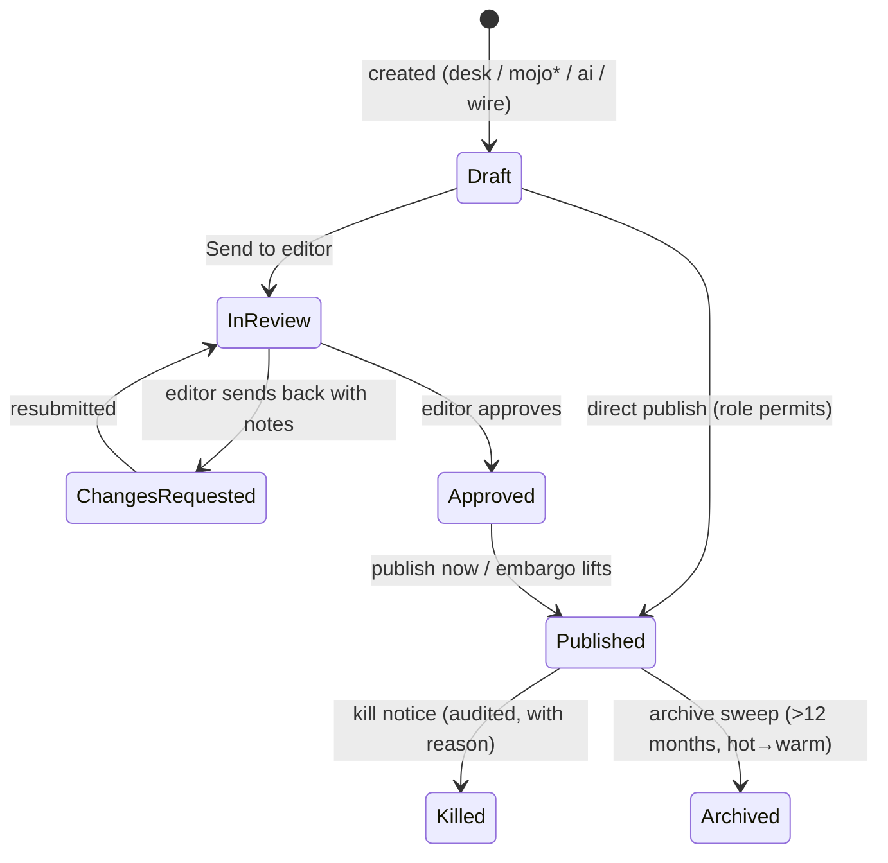

# Domain Knowledge & Business Rules — UNB Wire

> Domain model for the UNB Wire news service: newsroom admin, photo DAM, client
> portal, packages & distribution.
>
> **Canonical sources:** the approved contracts in `app-data/` —
> `v1-functional-requirements.md` (86 FRs, behavior), `v1-non-functional-requirements.md`
> (engineering contract), `v1-database-design.md` (schema), `README.md` (UI conversion
> guide). This file summarizes for quick agent orientation; on any disagreement the
> app-data docs win (README §10: NFR wins on behavior, prototype wins on look & feel).
>
> **Deferred:** field apps (MoJo / Photo desk PWA) — see `DEC-008`.

---

## 1. Domain Glossary

| Term | Definition |
|------|------------|
| **Story** | A unit of news content (headline, brief, body, category, tags, priority, language, media) distributed to clients. |
| **Desk** | Editorial grouping (English desk, Bangla desk, Photos). Bangla desk mirrors the English desk exactly (FR-NWS-009). |
| **Breaking / Urgent / Flash** | Priority levels; breaking triggers high-priority distribution and portal flags. |
| **Client** | Subscriber organization (newspaper, TV, portal, radio, govt, agency) consuming UNB content. |
| **Package** | Sellable bundle (news / photos / bundle) with a declarative `entitlement_filter` — replaces fixed tiers. |
| **Entitlement** | What a client may receive/see, computed as the union of their active packages. One definition drives delivery, portal visibility, and search tokens (FR-DST-002). |
| **Channel** | How a client receives content: API polling, FTP push, webhook (FR-DST-004). |
| **Edit lock** | Soft lock (`locked_by`/`locked_at`) shown as "Maria is editing now"; combined with optimistic `version` checks (stale save → 409 + merge prompt). Handover force-releases the lock (FR-NWS-013/014). |
| **Revision** | Immutable `story_versions` snapshot on every save/publish, with diff + restore (DEC-003). |
| **Embargo** | Hold-until time with explicit timezone, stored UTC; enforced in the delivery worker, never just hidden in UI (NFR §6/§11). |
| **Mirror pair** | Bangla story linked to its English counterpart via `mirror_of_id` — separate products, not row-per-translation. |

---

## 2. Editorial Lifecycle & State Machine

Canonical states (FR-NWS-010, DB design `stories.status`):

*(`mojo` source deferred with the field apps — DEC-008.)

### Rules
1. **Every transition is permission-checked server-side and audit-logged** (who/when/
   from→to in `story_events` — chain of custody, NFR §8).
2. **Ownership & handover:** each story has one owner; **Take over** transfers
   ownership, force-releases the edit lock, notifies the previous owner, and records
   a system note (FR-NWS-013).
3. **Concurrent editing:** saves carry `version`; stale save → 409 + merge prompt —
   never a silent overwrite (FR-NWS-014).
4. **Internal notes are newsroom-only and immutable** — never published, never on
   client APIs/feeds, never in client-reachable search indexes (FR-NWS-012).
5. **Scheduled/embargoed publish is time data, not a state:** `embargo_until`
   (explicit-tz input → stored UTC; workers compare in UTC only, ±60s precision).
6. **Publish** sets `published_at` once (UTC, server-set), writes a revision,
   writes `index_outbox`, and enqueues the distribution fan-out — all async after
   the state commit (FR-NWS-008, NFR §7).
7. **Unpublish/kill** fans out a correction/kill notice to every client that
   received the story (FR-DST-008).

---

## 3. Packages, Entitlements & Client Access

The old Public/Standard/Enterprise tier model is **replaced** (DEC-007):

- **Packages** declare `entitlement_filter`: `{languages, category_ids|null=all,
  media_kinds}` — declarative JSONB, compiled identically into delivery fan-out,
  portal visibility, and Meilisearch tenant-token filters. A client can never see
  in search what delivery would not send.
- **Client subscriptions** attach clients to packages with start/end dates;
  overlapping subscriptions union their entitlements; expiry cuts delivery + portal
  + API at once (FR-DST-003).
- **Delivery guarantees:** at-least-once with idempotency keys per
  (deliverable, client, channel); exponential backoff; auto-pause after N failures;
  `payload_hash` proves exactly which text went out (FR-DST-006).
- **Client API keys:** scoped, per-key rate limit (default 60 rpm), sha256-hashed
  (raw key shown once), rotation with two-key overlap (FR-CLT-003).
- **Suspension** stops delivery + portal + API access immediately (FR-CLT-001).

---

## 4. Media & Photo Desk

- Asset statuses: `field` (intake queue — **populated only when field apps ship,
  DEC-008**), `library`, `reedit`, `rejected`, `archived`. Desk uploads land in
  pending review (FR-MED-009).
- Desk review: approve / reject / request-re-edit with mandatory reason (preset +
  free note); decisions notify the uploader; urgent approvals land in the Exclusive
  package (FR-MED-006/007).
- Derivatives (thumb/small/large/webp; HLS for video) are worker-generated;
  derivative URLs immutable; originals go to cold storage after 12 months
  (FR-MED-008, NFR §3/§4).
- Duplicate detection via sha256 checksum on ingest (FR-MED-010).
- AP wire photos are read-only, clearly badged, never mixed into the UNB library
  (FR-MED-014/015).

---

## 5. AI Desk Guardrails

- AI is **assistive only**: nothing applies without explicit per-card user action;
  AI-populated fields carry "✦ AI — unreviewed" markers that drive a publish
  checklist gate (FR-AI-001/004/006).
- **New-facts detection** runs server-side (numbers, named entities, quotes vs
  source) — client-side flags are UX, the server check is the guarantee (NFR §14).
- **Auto-publish** is default OFF, modal-confirmed, allowlisted routine categories
  only (weather, sports results, market close, currency rates), rate-limited, and
  every auto-publish is audited (FR-AI-008).
- **Kill switch** disables all AI features newsroom-wide instantly, forces
  auto-publish off; flips are audited (FR-AI-009).
- **Confidentiality:** unpublished/embargoed/exclusive content goes to an LLM only
  under a zero-retention/no-training agreement — hard requirement (NFR §14).
- Per-desk monthly token budgets enforced server-side with 80%/100% alerts
  (FR-AI-007).

---

## 6. Invariants & Guardrails

1. **No broken publishes:** headline + category required; brief ≤ 280 chars
   (FR-NWS-005).
2. **Immutable history:** `story_versions`, `story_notes`, `story_events`,
   `audit_logs`, `deliveries`, `downloads` are append-only — enforced by DB grants
   (no UPDATE/DELETE for the app role).
3. **Entitlement isolation:** suspended/expired clients lose delivery, portal, API,
   and search visibility immediately and provably (one compiled filter).
4. **Nothing slow in request/response:** >100ms or external-system work runs in
   Horizon workers with idempotency keys (NFR §7).
5. **One clock stores, many clocks render:** UTC `timestamptz` storage; Dhaka for
   staff; client-local for portal; server-set timestamps on all ingest (NFR §11).
6. **Bangla correctness:** Unicode NFC normalization on every ingest and before
   indexing; conjunct-safe fonts/truncation (NFR §10).
7. **Soft delete only** — nothing hard-deleted except rejected field uploads and
   abandoned drafts (30-day purge, NFR §4).
